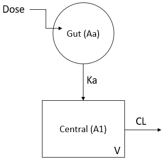

```{r certara-logo, echo=FALSE, message = FALSE, warning = FALSE, fig.width=1, fig.height=10}
knitr::opts_chunk$set(dpi=600) 
use_plotly <- params$use_plotly
include_data_overview <- params$include_data_overview

htmltools::img(src = knitr::image_uri(file.path('img', 'certara.PNG')), 
               alt = 'logo', 
               style = 'position:fixed; top:0; right:0; padding:10px; width:300px;')
```

# Notes and Conventions {.tabset .tabset-fade .tabset-pills} 

## Notes

::: {#description-overview}
* This is an example R Markdown report to demonstrate the workflow for building a "data memo" or report object in parallel with the conduct of a RsNLME analysis.
* We use html output and "tabsets" within the RMarkdown document to show how RsNLME can be used together with R markdown to produce very dense, interactive data summaries that capture a large amount of data in well organized, easily shared delivery mechanism.
:::

## Conventions used in this document

::: {.description}
* We've used blue text boxes to indicate descriptive information
:::

::: {.results}
* We've used yellow text boxes to indicate results
:::

::: {.keymessage}
*  Green text boxes provide key messages from the analysis results
*  Example:  This is a key message statement
:::

```{r session-set-up, warning=FALSE, message=FALSE, results=FALSE}
# Analysis ID     : Certara.R - ACOP 2022 RsNLME Report Example
# Purpose         : Introduce R Markdown 
# Other Info      : 
library(flextable)
library(plotly)
```

# Objectives {.tabset .tabset-fade .tabset-pills} 

The purpose of this data memo is to provide a summary of the base population pharmacokinetic model fit for study XYZ   

## Study Design
::: {.description}
*  150 healthy male and female subjects were enrolled in this study
*  Subjects were administered a single 5000, 10000, or 20000 ug dose of Drug XYZ at time=0
*  Blood samples were obtained at 0, 0.25, 0.5, 1, 2, 3, 4, 6, 8, 12, 16 and 24 hours after dosing
*  Covariates in the dataset include baseline subject age, weight, sex, and race
:::

## Methods
::: {.description}
*  Data analysis was conducted using the population pharmacokinetic program RsNLME version 1.1.0 (https://certara.github.io/R-RsNLME/index.html) 
*  etc.....
:::

```{r include-data-overview, child = if(include_data_overview) "child_rmd/data_overview.Rmd"}
```

# Base Model Development {.tabset .tabset-fade .tabset-pills}

## Summary

::: {.keymessage}
*  A 1 compartment model with first order oral input and elimination was used to fit the data
*  Convergence was achieved with successful estimation of parameter standard errors
:::

<br><br>

## Model Description {.tabset .tabset-fade .tabset-pills}

::: {.results}
*  A 1 compartment model with first order oral input and elimination was used to fit the data
*  Model parameters absorption rate constant (Ka), central clearance (Cl), and central volume (V)
*  Between subject variability terms on Ka, Cl and V 
*  Additive residual error model
:::

{width=35%}
```{r, base-model-specification}
basemod <- readRDS("./models/basemod.RDS")
print(basemod)
```

## Model Fit Summary {.tabset .tabset-fade .tabset-pills}
::: {.results}
*  Convergence was achieved with successful estimation of parameter standard errors
:::


### Additive Error Model
```{r, base-model-fit}
basemodfit <- readRDS("./basemod/basemodfit.RDS")
print(basemodfit)
```

### Multiplicative Error Model
```{r, base-model2-fit}
## View the updated model 
basemod2fit<-readRDS("./basemod2/basemod2fit.RDS")
print(basemod2fit)
```

### Covariate Model Search
```{r, covariate-model-fit}
covariatesearchresults <- readRDS("./covsearchmod/covsearchmodfit.RDS")
print(covariatesearchresults)
```


### Final Covariate Model
```{r, final-model-fit}
finalmodfit <- readRDS("./finalmod/finalmodfit.RDS")
print(finalmodfit)
```


## Base Model Diagnostics {.tabset .tabset-fade .tabset-pills}
### Additive Residual Error Model {.tabset .tabset-fade .tabset-pills}
#### Structural Model {.tabset .tabset-fade .tabset-pills}
::: {.keymessage}
* A multiplicative residual error model was selected in place of 
* the base model additive error model
:::

##### DV vs PRED

```{r dx-basedvpred, echo = TRUE, warning=FALSE, message=FALSE, fig.width = 8, fig.height = 6}

basedvpred <- readRDS(file='./plots/basedvpred.RDS')
basedvpred

```

##### DV vs IPRED

```{r dx-basedvipred, echo = TRUE, warning=FALSE, message=FALSE, fig.width = 8, fig.height = 6}

basedvipred <- readRDS(file='./plots/basedvipred.RDS')
basedvipred

```

##### CWRES vs TIME

```{r dx-baseresidv, echo = TRUE, warning=FALSE, message=FALSE, fig.width = 8, fig.height = 6}

baseresidv <- readRDS(file='./plots/baseresidv.RDS')
baseresidv

```

##### CWRES vs IPRED

```{r dx-baserespred, echo = TRUE, warning=FALSE, message=FALSE, fig.width = 8, fig.height = 6}

baserespred <- readRDS(file='./plots/baserespred.RDS')
baserespred

```

##### absCWRES vs IPRED

```{r dx-basearespred, echo = TRUE, warning=FALSE, message=FALSE, fig.width = 8, fig.height = 6}

basearespred <- readRDS(file='./plots/basearespred.RDS')
basearespred

```

#### Covariate Model {.tabset .tabset-fade .tabset-pills}

::: {.keymessage}
* CL appears to be influenced by subject bodyweight
:::

##### Parameter vs WT

```{r dx-baseprmcovwt, echo = TRUE, warning=FALSE, message=FALSE, fig.width = 8, fig.height = 6}

baseprmcovwt <- readRDS(file='./plots/baseprmcovwt.RDS')
baseprmcovwt

```

##### ETA vs WT

```{r dx-baseetacovwt, echo = TRUE, warning=FALSE, message=FALSE, fig.width = 8, fig.height = 6}

baseetacovwt <- readRDS(file='./plots/baseetacovwt.RDS')
baseetacovwt

```

### Multiplicative Residual Error Model {.tabset .tabset-fade .tabset-pills}
#### Structural Model {.tabset .tabset-fade .tabset-pills}
::: {.keymessage}
* A multiplicative residual error model was selected in place of 
* the base model additive error model
:::

##### DV vs PRED

```{r dx-basenewdvpred, echo = TRUE, warning=FALSE, message=FALSE, fig.width = 8, fig.height = 6}

basenewdvpred <- readRDS(file='./plots/basenewdvpred.RDS')
basenewdvpred

```

##### DV vs IPRED

```{r dx-basenewdvipred, echo = TRUE, warning=FALSE, message=FALSE, fig.width = 8, fig.height = 6}

basenewdvipred <- readRDS(file='./plots/basenewdvipred.RDS')
basenewdvipred

```

##### CWRES vs TIME

```{r dx-basenewresidv, echo = TRUE, warning=FALSE, message=FALSE, fig.width = 8, fig.height = 6}

basenewresidv <- readRDS(file='./plots/basenewresidv.RDS')
basenewresidv

```

##### CWRES vs IPRED

```{r dx-basenewrespred, echo = TRUE, warning=FALSE, message=FALSE, fig.width = 8, fig.height = 6}

basenewrespred <- readRDS(file='./plots/basenewrespred.RDS')
basenewrespred

```

##### absCWRES vs IPRED

```{r dx-basenewarespred, echo = TRUE, warning=FALSE, message=FALSE, fig.width = 8, fig.height = 6}

basenewarespred <- readRDS(file='./plots/basenewarespred.RDS')
basenewarespred

```

#### Covariate Model {.tabset .tabset-fade .tabset-pills}

::: {.keymessage}
* CL appears to be influenced by subject bodyweight
:::

##### Parameter vs WT

```{r dx-basenewprmcovwt, echo = TRUE, warning=FALSE, message=FALSE, fig.width = 8, fig.height = 6}

basenewprmcovwt <- readRDS(file='./plots/basenewprmcovwt.RDS')
basenewprmcovwt

```

##### ETA vs WT

```{r dx-basenewetacovwt, echo = TRUE, warning=FALSE, message=FALSE, fig.width = 8, fig.height = 6}

basenewetacovwt <- readRDS(file='./plots/basenewetacovwt.RDS')
basenewetacovwt

```

##### ETAs vs All Covariates
```{r dx-baseranparcov, echo = TRUE, warning=FALSE, message=FALSE, fig.width = 8, fig.height = 6}

basenewranparcov <- readRDS(file='./plots/basenewranparcov.RDS')
basenewranparcov

```

# Covariate Models {.tabset .tabset-fade .tabset-pills}

## Summary

::: {.keymessage}
*  Significant covariates in single covariate model runs include...
*  
:::

<br><br>


## Run1WTonCL {.tabset .tabset-fade .tabset-pills}

### Model Fit Summary {.tabset .tabset-fade .tabset-pills}
```{r, run1-WTonCL-fit}

run1WTonCLfit<-readRDS("./models/run1WTonCLfit.RDS")
print(run1WTonCLfit)

```

### Structural Model {.tabset .tabset-fade .tabset-pills}
#### DV vs PRED

```{r dx-run1dvpred, echo = TRUE, warning=FALSE, message=FALSE, fig.width = 8, fig.height = 6}

run1dvpred <- readRDS(file='./plots/run1dvpred.RDS')
run1dvpred

```

#### DV vs IPRED

```{r dx-run1dvipred, echo = TRUE, warning=FALSE, message=FALSE, fig.width = 8, fig.height = 6}

run1dvipred <- readRDS(file='./plots/run1dvipred.RDS')
run1dvipred

```

#### CWRES vs TIME

```{r dx-run1residv, echo = TRUE, warning=FALSE, message=FALSE, fig.width = 8, fig.height = 6}

run1residv <- readRDS(file='./plots/run1residv.RDS')
run1residv

```

#### CWRES vs IPRED

```{r dx-run1respred, echo = TRUE, warning=FALSE, message=FALSE, fig.width = 8, fig.height = 6}

run1respred <- readRDS(file='./plots/run1respred.RDS')
run1respred

```

### Covariate Model {.tabset .tabset-fade .tabset-pills}

#### ETAs vs All Covariates
```{r dx-run1ranparcov, echo = TRUE, warning=FALSE, message=FALSE, fig.width = 8, fig.height = 6}

run1ranparcov <- readRDS(file='./plots/run1ranparcov.RDS')
run1ranparcov

```

## Run2SEXonCL {.tabset .tabset-fade .tabset-pills}

### Model Fit Summary {.tabset .tabset-fade .tabset-pills}
```{r, run2-SEXonCL-fit}

run2SEXonCLfit<-readRDS("./models/run2SEXonCLfit.RDS")
print(run2SEXonCLfit)

```

### Structural Model {.tabset .tabset-fade .tabset-pills}
#### DV vs PRED

```{r dx-run2dvpred, echo = TRUE, warning=FALSE, message=FALSE, fig.width = 8, fig.height = 6}

run2dvpred <- readRDS(file='./plots/run2dvpred.RDS')
run2dvpred

```

#### DV vs IPRED

```{r dx-run2dvipred, echo = TRUE, warning=FALSE, message=FALSE, fig.width = 8, fig.height = 6}

run2dvipred <- readRDS(file='./plots/run2dvipred.RDS')
run2dvipred

```

#### CWRES vs TIME

```{r dx-run2residv, echo = TRUE, warning=FALSE, message=FALSE, fig.width = 8, fig.height = 6}

run2residv <- readRDS(file='./plots/run2residv.RDS')
run2residv

```

#### CWRES vs IPRED

```{r dx-run2respred, echo = TRUE, warning=FALSE, message=FALSE, fig.width = 8, fig.height = 6}

run2respred <- readRDS(file='./plots/run2respred.RDS')
run2respred

```

### Covariate Model {.tabset .tabset-fade .tabset-pills}

#### ETAs vs All Covariates
```{r dx-run2ranparcov, echo = TRUE, warning=FALSE, message=FALSE, fig.width = 8, fig.height = 6}

run2ranparcov <- readRDS(file='./plots/run2ranparcov.RDS')
run2ranparcov

```

## Run3WTonV {.tabset .tabset-fade .tabset-pills}

### Model Fit Summary {.tabset .tabset-fade .tabset-pills}
```{r, run3-WTonV-fit}

run3WTonVfit<-readRDS("./models/run3WTonVfit.RDS")
print(run3WTonVfit)

```

### Structural Model {.tabset .tabset-fade .tabset-pills}
#### DV vs PRED

```{r dx-run3dvpred, echo = TRUE, warning=FALSE, message=FALSE, fig.width = 8, fig.height = 6}

run3dvpred <- readRDS(file='./plots/run3dvpred.RDS')
run3dvpred

```

#### DV vs IPRED

```{r dx-run3dvipred, echo = TRUE, warning=FALSE, message=FALSE, fig.width = 8, fig.height = 6}

run3dvipred <- readRDS(file='./plots/run3dvipred.RDS')
run3dvipred

```

#### CWRES vs TIME

```{r dx-run3residv, echo = TRUE, warning=FALSE, message=FALSE, fig.width = 8, fig.height = 6}

run3residv <- readRDS(file='./plots/run3residv.RDS')
run3residv

```

#### CWRES vs IPRED

```{r dx-run3respred, echo = TRUE, warning=FALSE, message=FALSE, fig.width = 8, fig.height = 6}

run3respred <- readRDS(file='./plots/run3respred.RDS')
run3respred

```

### Covariate Model {.tabset .tabset-fade .tabset-pills}

#### ETAs vs All Covariates
```{r dx-run3ranparcov, echo = TRUE, warning=FALSE, message=FALSE, fig.width = 8, fig.height = 6}

run3ranparcov <- readRDS(file='./plots/run3ranparcov.RDS')
run3ranparcov

```

# Visual Run Record {.tabset .tabset-fade .tabset-pills}

`r htmltools::includeHTML(path = "./run_record/run_record.html")`
               
# Simulation {.tabset .tabset-fade .tabset-pills}

## Summary

::: {.keymessage}
*  The final model was used to simulate a multiple dose regime of 5000, 10000, or 20000 ug q6h * 2 days ...
*  
:::

<br><br>

## Simulation Output {.tabset .tabset-fade .tabset-pills}

```{r, simq6h, warning=FALSE}

finalsimq6hbywtgrp<-readRDS("./models/finalsimq6hbywtgrp.RDS")
print(finalsimq6hbywtgrp)

```


# Session Info {.tabset .tabset-fade .tabset-pills}

```{r, session-info,comment = NA}
sessionInfo()
```
