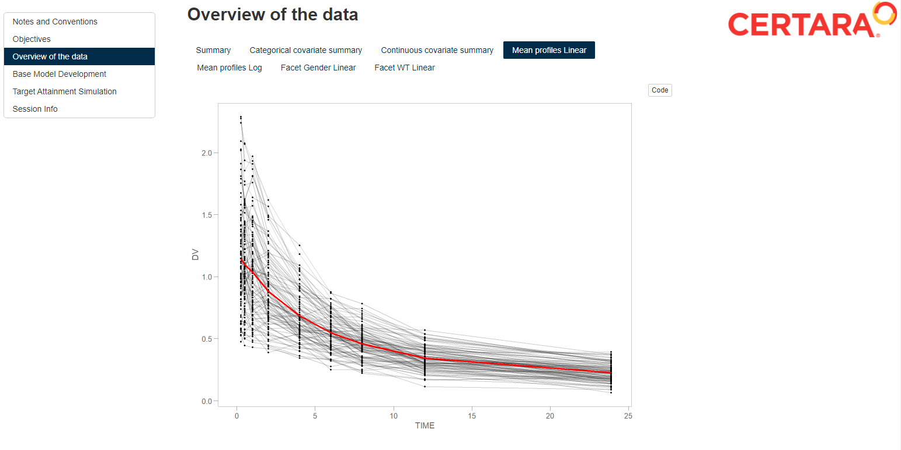

# R-ACOP-2022

----

An example of how to use RsNLME with RMarkdown to efficiently prepare a report.

<a href="BaseModelSummary.html" download>View Example Report</a>



## Requirements

In order to execute the following example you must have installed:

* Certara.RsNLME v1.1.0
* NLME Engine v21.11.2

Click [here](https://certara.github.io/R-RsNLME/articles/installation.html) for installation details. Visit the [`Certara.R` website](https://certara.github.io/R-Certara/) for more information about R packages developed by Certara.

## Usage

After cloning the repository, open `ACOP2022.Rproj` in RStudio.

The following R Script will create and execute the RsNLME model. Model diagnostic plots and tables will be saved as `.RDS` file in your working directory.

``` r
source("ACOP2022.R")
```

Next, you may 'knit` the `ACOP2022_Summary_Report.Rmd` file and make any revisions as you see fit.

